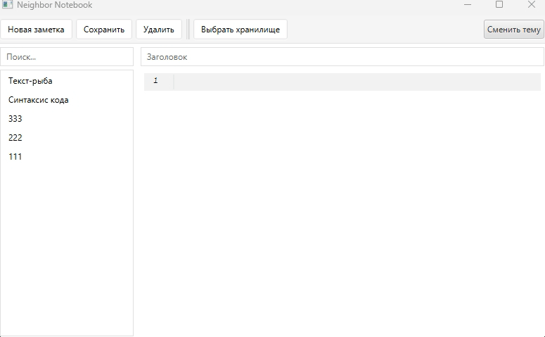

# Neighbor Notebook (в разработке...)

Современное приложение для создания и управления заметками с поддержкой форматирования текста и кода.  



## Возможности

- Подсветка синтаксиса для кода
- Редактирование и визуализация Markdown
- Работа с локальными файлами
- Поддержка светлой и тёмной тем
- Быстрый поиск по заметкам
- Поддержка различных кодировок
- Автосохранение
- Горячие клавиши для основных операций

## Технологии

- Java 21
- JavaFX для пользовательского интерфейса
- Spring Boot 3.2
- Gradle для сборки
- RichTextFX для редактора кода
- Jackson для работы с JSON
- SLF4J + Logback для логирования

## Требования

- Java 21 или выше
- Gradle 8.5 или выше
- Минимальное разрешение экрана: 800x500

## Установка

1. Клонируйте репозиторий:
```bash
git clone https://github.com/neighborstan/neighbor-notebook.git
```

2. Перейдите в директорию проекта:
```bash
cd neighbor-notebook
```

3. Соберите проект:
```bash
./gradlew build
```

4. Запустите приложение:
```bash
./gradlew run
```

## Использование

### Основные операции

- `Ctrl + N` - Новая заметка
- `Ctrl + S` - Сохранить заметку
- `Ctrl + Del` - Удалить заметку
- `Ctrl + F` - Поиск

### Редактирование текста

- `Ctrl + X` - Вырезать
- `Ctrl + C` - Копировать
- `Ctrl + V` - Вставить
- `Ctrl + A` - Выделить всё

## Обновления

### Версия 0.0.1
- Базовый функционал создания и редактирования заметок
- Подсветка синтаксиса для Java
- Поддержка тёмной и светлой тем
- Локальное хранение заметок
- Поиск по заметкам 
